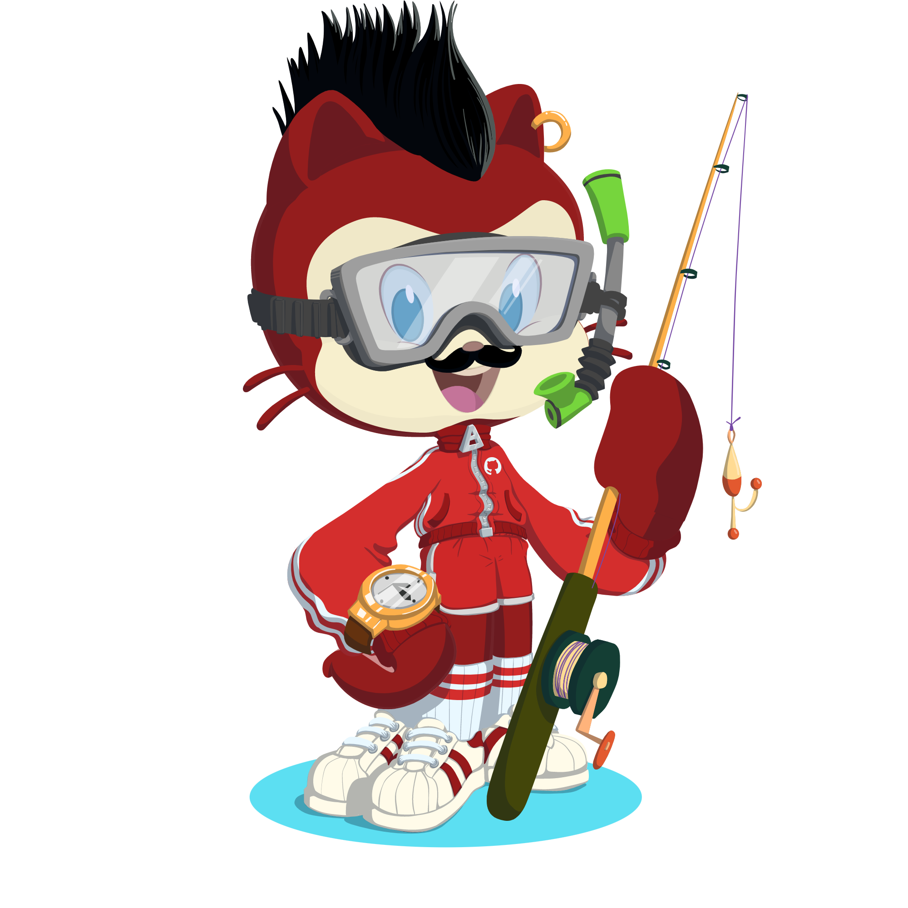
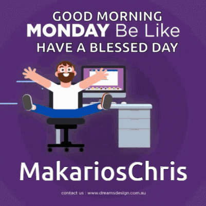

# Olá, me chamo Fernando Costa!

## "Bem vindo ao meu perfil GitHub" 👋

 

MakariosChris

*"Amo a carreira de Desenvolvedor Web, posso afirmar com certeza que é uma carreira promissora pois, além de ter um grande potencial de crescimento para os próximos anos, também possui uma demanda enorme por profissionais com habilidades mais específicas. Por isso, estou aproveitando o momento e investindo em conhecimento nessa área."*

### Bootcamp's Realizados:

* Bootcamp Nex Gen CI&T - Desenvolvedor Junior, com foco em conhecimento em java + SpringBoot no Back End e Angular no Front End - 148h.

* Bootcamp Embraer SocialTech, com foco em Análise de Dados e Business Intelligence - 148h.

* Bootcamp Banco PAN java Developer - 114h.

  

  

